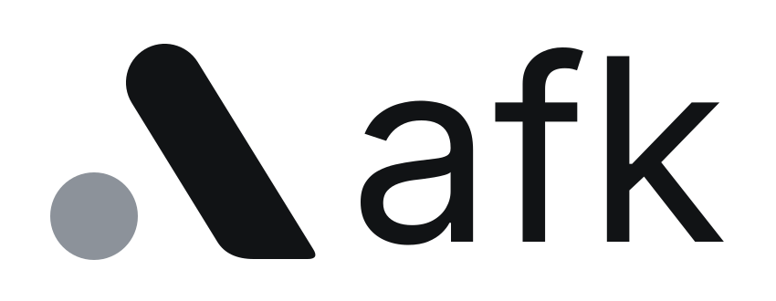

<p align="center">
  <a href="https://goafk.dev">
    <picture>
      <source media="(prefers-color-scheme: dark)" srcset="static/assets/brand/afk-logo-dark.svg">
      
    </picture>
  </a>
</p>

<p align="center"><strong>Away from keyboard, not away from control.</strong></p>

<p align="center">
  The source of <a href="https://goafk.dev"><strong>goafk.dev</strong></a>, the afk website.
  <br>
  <a href="https://github.com/goafk/hub">Hub</a> · <a href="https://github.com/goafk/app">Phone app</a>
</p>

<p align="center">
  <a href="https://goafk.dev"></a>
</p>

---

## What's here

The landing page, docs, privacy page and the one-line installer served at
`https://goafk.dev/install.sh`. It's a small static site: plain HTML, CSS and JavaScript, no framework
and nothing to install. It's hosted on Cloudflare Pages.

## Run it locally

```sh
npm run dev
```

Then open [localhost:8788](http://localhost:8788). (Needs Node 18+.)

## Publish

```sh
npm run deploy
```

Builds the site and puts it live on goafk.dev in about ten seconds.

## Change something

| To change… | Edit |
| --- | --- |
| The landing page | `src/pages/index.html` |
| Docs / privacy | `src/pages/docs.html`, `src/pages/privacy.html` |
| Header and footer | `src/partials/` |
| Colours, type, layout | `static/assets/css/site.css` (brand tokens at the top) |
| Animations and the demos | `static/assets/js/site.js` |
| The installer | Change it in [goafk/hub](https://github.com/goafk/hub), then run `scripts/sync-install.sh ../afk` |

Everything else (analytics events, the launch sign-up list, security headers, screenshots) is in
[docs/MAINTAINING.md](docs/MAINTAINING.md).

## The afk repos

| Repo | What |
| --- | --- |
| [goafk/hub](https://github.com/goafk/hub) | The hub that runs on your computer |
| [goafk/app](https://github.com/goafk/app) | The phone app |
| **[goafk/website](https://github.com/goafk/website)** | This repo: goafk.dev |

---

<sub>MIT licensed. afk is an independent project, not affiliated with Zed Industries.</sub>
